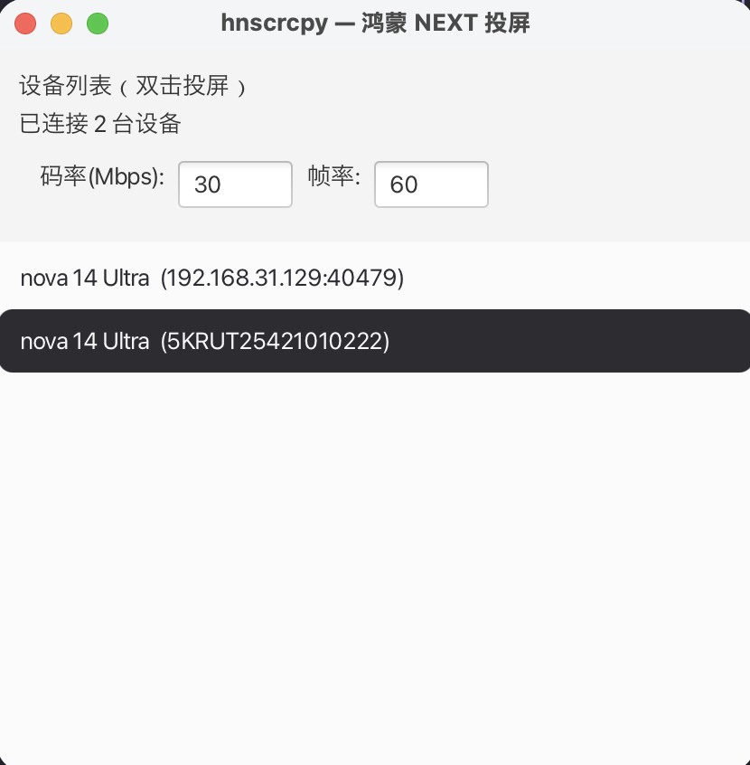
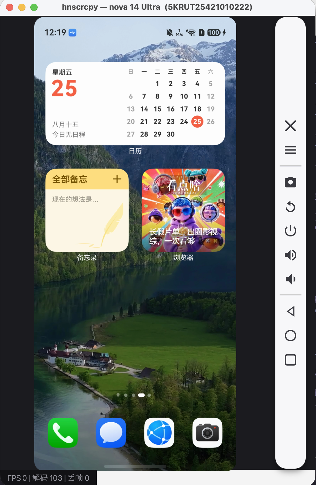
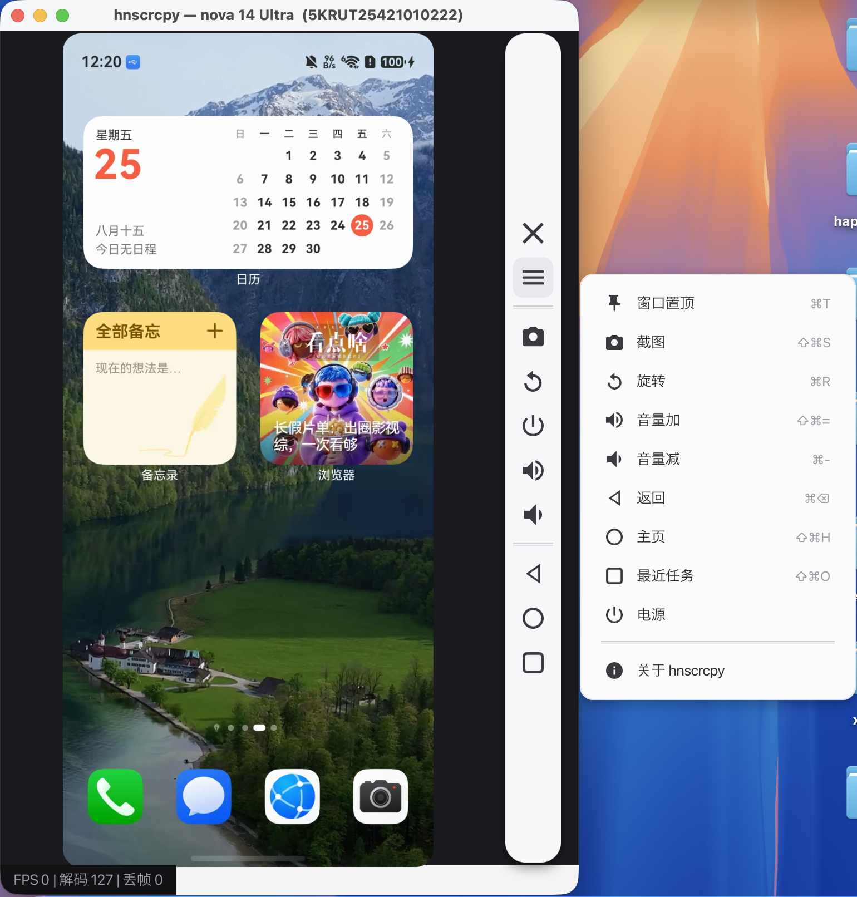
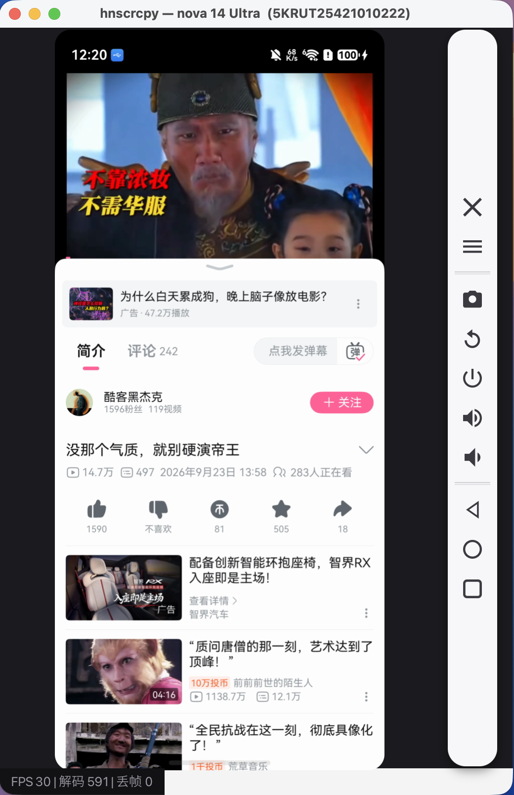
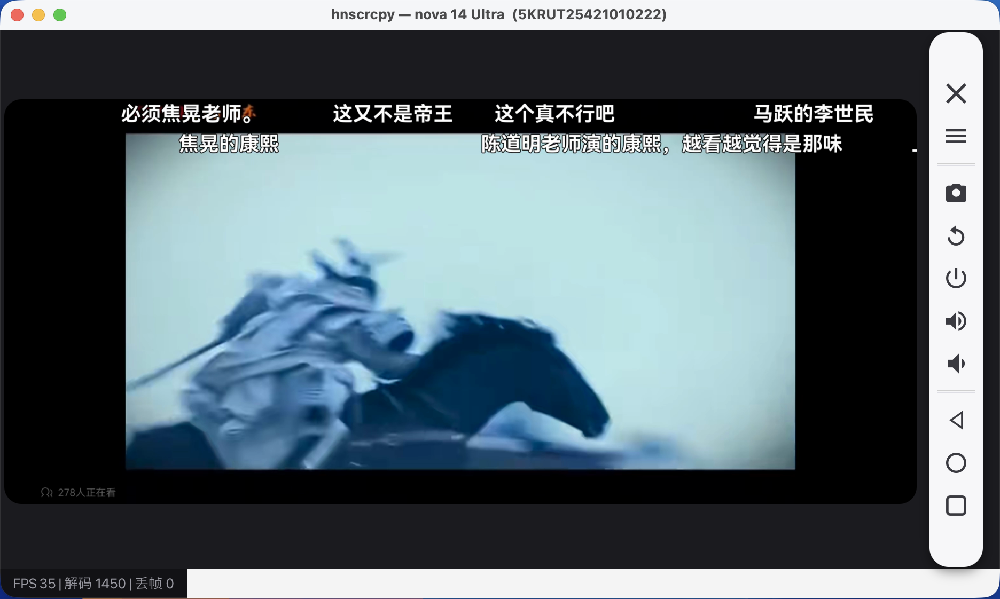

# hnscrcpy

鸿蒙 NEXT（HarmonyOS NEXT）投屏远控桌面工具 —— 类似 scrcpy 的体验：
打开即用，无需安装 Java / hdc / 任何环境，即可将设备屏幕实时镜像到
Windows / macOS / Linux 窗口，并用键鼠远程操作。

- 视频源：hosScrcpy H.264 流（gRPC over hdc forward，按屏幕变化推流）
- 解码：FFmpeg/avcodec 多线程直解（零 demuxer 延迟，环形缓冲零拷贝渲染）
- 技术栈：Java 17 + JavaFX 21 + JavaCPP(FFmpeg) + 内置 HDC
- 平台：Windows x64、macOS arm64、macOS x86_64、Linux x86_64
- **零外部依赖**：JRE、hdc（四平台）、hosScrcpy 全部内置在应用包中

## 软件截图

| 主界面：设备自动发现，双击投屏 | 竖屏投屏 + 侧边悬浮工具栏 |
|:---:|:---:|
|  |  |

| 快捷菜单：置顶/截图/旋转/音量/导航键 | 竖屏视频播放：高负载零丢帧 |
|:---:|:---:|
|  |  |

| 横屏视频播放：窗口自动跟随旋转 | |
|:---:|:---:|
|  | |

## 功能

- 设备列表自动发现（USB / 模拟器），双击投屏，支持多台设备同时投屏
- 实时镜像（60fps 配置上限，H.264 硬编），窗口等比缩放
- 远控：左键触摸、右键/中键鼠标事件、滚轮、拖拽
- 快捷键（macOS ⌘ / Win·Linux Ctrl）：`⌘T` 窗口置顶、`⇧⌘S` 截图、`⌘R` 旋转、`⇧⌘=` 音量加、`⌘-` 音量减、`⌘⌫` 返回、`⇧⌘H` 主页、`⇧⌘O` 最近任务
- 右侧悬浮工具条：截图 / 旋转 / 电源 / 音量± / 返回·主页·最近任务；☰ 菜单含置顶与关于
- 截图保存到 `~/Pictures/hnscrcpy/`
- 设备旋转自适应（横竖屏切换窗口与坐标自动跟随）
- 断流自动重连（指数退避 + 看门狗，状态栏可见重连进度）
- CLI：`--serial / --bit-rate / --fps / --no-control`（`--help` 查看全部）

## 下载

GitHub [Releases](https://github.com/taxiao213/hnscrcpy/releases) 提供四平台安装包
（打 `v*` tag 由 CI 自动构建发布）：

| 平台 | 产物 |
|------|------|
| macOS Apple Silicon | `hnscrcpy-mac-arm64.dmg` |
| macOS Intel | `hnscrcpy-mac-x64.dmg` |
| Windows x64 | `hnscrcpy-windows-x64-setup.exe` |
| Linux x86_64 | `hnscrcpy-linux-x64.deb` / `.tar.gz` 免安装包 |

> macOS 首次打开如提示"未受信任的开发者"：右键 → 打开。

## 从源码构建

```bash
mvn javafx:run                 # 开发模式
mvn test                       # 单元测试（含 golden 样本解码）
./scripts/build-package.sh     # macOS/Linux 出包（target/dist/）
scripts\build-package.ps1      # Windows 出包
```

本地构建默认产出免安装 app-image；`INSTALLER=1` 额外生成安装包（dmg/exe/deb）。

CLI 示例：

```bash
hnscrcpy --serial 5KRUT25421010222 --bit-rate 30 --fps 60
hnscrcpy --no-control          # 只看不控
```

## 文档

| 文档 | 内容 |
|------|------|
| [docs/PRD.md](docs/PRD.md) | 产品需求、功能清单、CLI 设计 |
| [docs/ARCHITECTURE.md](docs/ARCHITECTURE.md) | 架构设计、模块划分、数据流、风险 |
| [docs/TASKS.md](docs/TASKS.md) | 里程碑任务分解（M0–M6 全部完成） |
| [docs/HOS_SCRCPY_PROTOCOL.md](docs/HOS_SCRCPY_PROTOCOL.md) | hosScrcpy 协议逆向结论（M0） |

## 状态

**v1.0.0（2026-09-25）**：M0–M6 全部完成，真机（MRT-AL10 / HarmonyOS NEXT 6.1）验证通过。

- 视频管线：gRPC 流 → avcodec 多线程直解 → 环形缓冲零拷贝渲染，高负载实测 50–57fps 零丢帧
- 远控：触摸/鼠标/滚轮/按键（uitest 通道 + uinput）真机验证，横竖屏坐标自适应
- 打包：jpackage（dmg/exe/deb），GitHub Actions 四平台 CI，tag 触发自动发布
- 测试：86 个单元测试（UI/会话装配层由真机冒烟验证）

## 已知限制

- 视频恒为设备原始分辨率（自适应降采样仅作用于渲染输出）
- 模拟器（127.0.0.1:5555）兼容性未实测
- 音频转发暂不支持（hosScrcpy 无音频通道）

## 作者与联系

| 渠道 | 信息 |
|------|------|
| **作者** | taxiao |
| **微信公众号** | 他晓 |
| **邮箱** | yin13753884368@163.com |
| **CSDN** | <http://blog.csdn.net/yin13753884368/article> |
| **GitHub** | <https://github.com/taxiao213> |

> 💬 **进群交流**：扫码添加个人微信，回复「**他晓**」即可进群。

| 微信公众号「他晓」 | 个人微信（回复「他晓」进群） |
|:---:|:---:|
|  |  |
